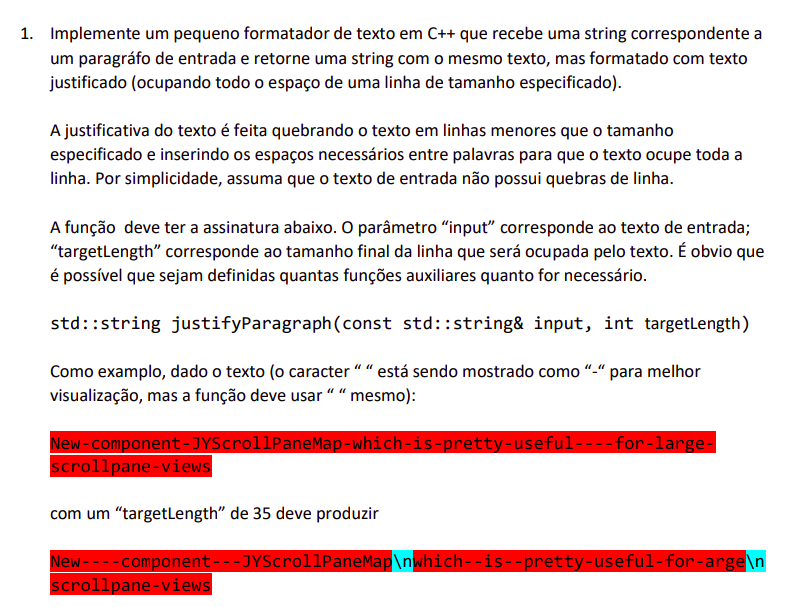
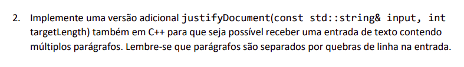
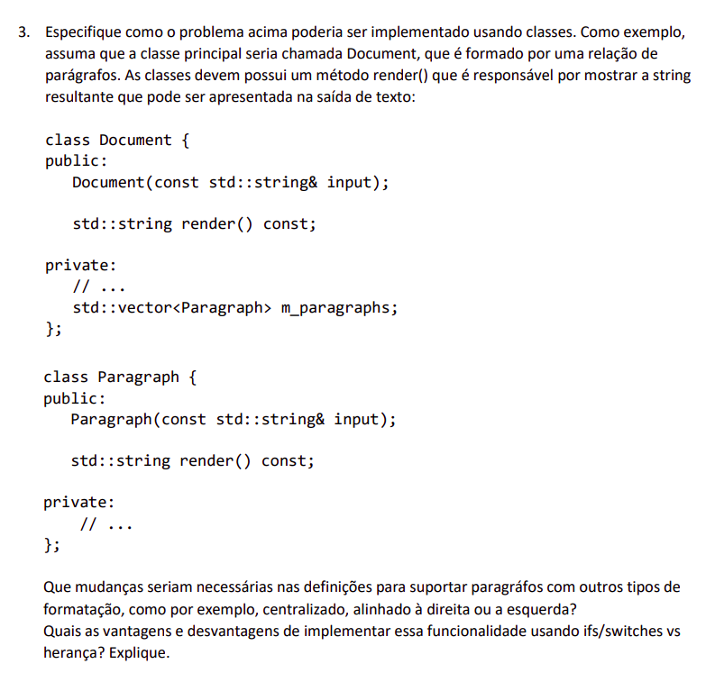
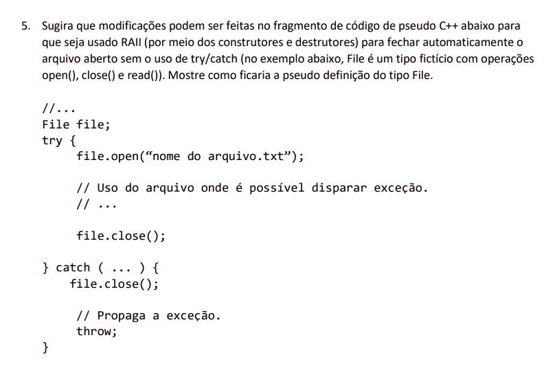

# **CSR**
Teste de habilidades da vaga de desenvolvedor do [**CSR**](https://csr.ufmg.br/csr/pt/) de **Nander Carmo**.

Julho de 2021.

---

## **Índice**

- [Questão 1](#questão-1)
- [Questão 2](#questão-2)
- [Questão 3](#questão-3)
	- [Implementação da Classe](#implementação-da-classe)
	- [Novas Formatações](#novas-formatações)
	- [Herança x Tratamento Condicional](#herança-x-tratamento-condicional)
- [Questão 4](#questão-4)
	- [Referências x Ponteiros](#referências-x-ponteiros)
	- [Smart Pointers](#smart-pointers)
- [Questão 5](#questão-5)

---

## **Questão 1**

<p align="center">
  
</p>

O formatador de texto especificado foi implementado e está disponível no arquivo:

- [source/question1/my-formatter.cpp](source/question1/my-formatter.cpp)

Para implementar o formatador descrito foram criadas as seguintes funções auxiliares, cujos parâmetros, retorno e funcionalidade básica serão detalhadas a seguir:

- **MyStringVector**:
	
	```cpp 
	typedef std::vector<std::string> MyStringVector;
	```

	Esse tipo foi criado para facilitar o desenvolvimento utilizando um vetor de strings.

- MyVectorIterator:

	```cpp 
	typedef MyStringVector::iterator MyVectorIterator;
	```

	Esse tipo foi criado para facilitar o uso de iterators do tipo vetor de strings.

- **justifyParagraph**

	```cpp 
	std::string justifyParagraph(const std::string & input, int targetLength);
	```

	- Parâmetros: uma string **input** contendo o texto que se deseja formatar e um inteiro **targetLength** reponsável por indicar a largura final do texto.

	- Retorno: uma string contendo o texto formatado.

	- Funcionalidade: realiza a extração das palavras do texto, através da chamada da fução getParagraphWords, seguida da definição de quais palavras estarão em cada linha do texto. Feito isso a função getFormattedRow é chamada para efetivamente formatar a linha desejada com o alinhamento justificado.
	

- **getParagraphWords**

	```cpp 
	MyStringVector getParagraphWords(const std::string & paragraph);
	```

	- Parâmetros: uma string **pargraph** contendo o parágrafo que será formatado.
	
	- Retorno: um vetor de strings contendo todas as palavras (e símbolos) do parágrafo.
	
	- Funcionalidade: percorre o parágrafo realizando o tratamento do texto, eliminando qualquer espaço presente no texto e retornando apenas as palavras e símbolos.

- **getFormattedRow**

	```cpp 
	std::string getFormattedRow(MyVectorIterator & rowFirstWord, MyVectorIterator & rowLastWord, int rowCharCount, int targetLength, bool isLastRow);
	```

	- Parâmetros: dois iterators **rowFistWord** e **rowLastWord**, responsáveis por armazenar a primeira e a última palavra do vetor que deverá aparecer na linha a ser formatada, um inteiro **rowCharCount** contendo a quantidade de caracteres válidos (que não são espaços) que a linha possui, um inteiro **targetLength** contendo a largura da linha e, por fim um booleano **isLastRow** que indica se a linha sendo formatada é a última linha do parágrafo (essa linha não deve ser formatada).
	
	- Retorno: uma string contendo a linha formatada.
	
	- Funcionalidade: percorre as palavras do parágrafo que deverão estar presentes da linha adicionando espaçamento entre elas, até atingir a largura total da linha.

- **printVector**

	```cpp 
	void printVector(MyStringVector & vctr);
	```

	- Parâmetros: um vetor **vctr** que se deseja printar.
	
	- Retorno: essa função não retorna nada.
	
	- Funcionalidade: essa função auxiliar percorre as strings do vetor passado como parâmetro e printa esses valores formatados.
	
---

## **Questão 2**

<p align="center">
  
</p>

A código final do formatador de texto, após a implementação da função **justifyDocument** está disponível no arquivo:

- [source/question2/my-formatter-2.cpp](source/question2/my-formatter-2.cpp)

Para implementar essa nova funcionalidade foi preciso apenas adicionar mais uma função auxiliar de forma a identificar e separar os parágrafos do texto:

- **justifyDocument**

	```cpp 
	std::string justifyDocument(const std::string & input, int targetLength);
	```

	- Parâmetros: uma string **input** contendo o texto que se deseja formatar e um inteiro **targetLength** reponsável por indicar a largura final do texto.

	- Retorno: uma string contendo o texto formatado.

	- Funcionalidade: essa função realiza a divisão do texto em parágrafos através da chamada interna da função **getParagraphs** e realiza a formatação de cada um desses parágrafos da mesma forma que foi descrita na [Questão 1](#questão-1)

- **getParagraphs**

	```cpp 
	MyStringVector getParagraphs(const std::string & text);
	```

	- Parâmetros: uma string **text** contendo o texto que se deseja dividir em parágrafos.
	- Retorno: um vetor de strings contendo os parágrafos do texto recebido.
	- Funcionalidade: percorre o texto identificando sempre que aparece uma quebra de linha, indicando um parágrafo, e realiza a divisão em strings em um vetor.

---

## **Questão 3**

<p align="center">
  
</p>

### **Implementação da Classe**

A implementação final do formatador utilizando classe está contida nos arquivos abaixo:

- [source/question3/paragraph.h](source/question3/paragraph.h)
- [source/question3/paragraph.cpp](source/question3/paragraph.cpp)
- [source/question3/document.h](source/question3/document.h)
- [source/question3/document.cpp](source/question3/document.cpp)
- [source/question3/main.cpp](source/question3/main.cpp)

Para a implementação do mesmo formatador utilizando classes foi realizado o seguinte raciocício: as funções implementadas no formatador **justifyParagraph**, **getParagraphWords** e **getFormattedRow** correspondem a manipulações que são realizadas nos parágrafos e logo foram transformadas em métodos da classe **Paragraph**; já as funções **justifyDocument**, **getParagraphs** são funções intrínsecas ao documento e, assim, foram transformadas em métodos da classe **Document**.

As funções equivalente à classe **Paragraph** foram renomeadas e receberam novas assinaturas, de forma a ficar mais legível no contexto de uma classe, ficando da seguinte forma:

- justifyParagraph -> **format**
- getParagraphWords -> **getWords**
- getFormattedRow -> **formatRow**

As funções equivalente à classe **Document** foram renomeadas e receberam uma nova assinatura, de forma a ficar mais legível no contexto de uma classe, ficando da seguinte forma:

- justifyDocument -> **format**
- getParagraphs -> **getParagraphs**

Além disso, as variáveis utilizadas dentro das funções e que são passadas como parâmetros foram transformadas em campos das classes. Dessa forma, a definição das duas classes ficou da seguinte forma:

```cpp
class Paragraph {
	
	public:

		Paragraph(const std::string &);
		std::string render() const;
		void setTargetLength(int);
		void format();

	private:

		std::string m_input;
		std::string m_formatted;
		std::vector<std::string> m_words;
		std::vector<std::string>::iterator m_rowFirstWord;
		std::vector<std::string>::iterator m_rowLastWord;
		int m_targetLength;
		int m_rowSpacesCount;
		int m_rowCharCount;

		void formatRow(bool);
		void getWords();
};
```

```cpp
class Document {
	
	public:

		Document(const std::string & input);
		std::string render() const;
		void setTargetLength(int);
		void format();

	private:

		std::vector<Paragraph> m_paragraphs;
		std::string m_input;
		std::string m_formatted;
		int m_targetLength;

		void getParagraphs();
}; 
```

### **Novas Formatações**

Para implementar novos formatadores utilizando de herança seria necessário, primeiro transformar o método *Paragraph::formatRow()* em um método virtual, para permitir que ele seja reimplementada por outras classes que herdem a classe básica *Paragraph*. Além disso, para que as classes herdeiras tenham acesso aos métodos e campos marcados *private* originalmente, será preciso alterar esse marcador para *protected*. Dessa forma:

```cpp
class Paragraph {
	
	public:

		Paragraph(const std::string &);
		std::string render() const;
		void setTargetLength(int);
		void format();

	protected:

		std::string m_input;
		std::string m_formatted;
		std::vector<std::string> m_words;
		std::vector<std::string>::iterator m_rowFirstWord;
		std::vector<std::string>::iterator m_rowLastWord;
		int m_targetLength;
		int m_rowSpacesCount;
		int m_rowCharCount;

		virtual void formatRow(bool);
		void getWords();
};
```

Dessa forma, será possível criar classes que herdam da classe *Paragraph* e possuem seus próprios métodos *formatRow*:

```cpp
class CentralizedParagraph : public Paragraph  {

	public:

		...

	protected:

		virtual void formatRow(bool) override;
		// Reimplementação do método de formatar linha para retornar a linha centralizada
}

class LeftAlignedParagraph : public Paragraph {

	public:

		...

	protected:

		virtual void formatRow(bool) override; 
		// Reimplementação do método de formatar linha para retornar a linha alinhada à esquerda
}

class RightAlignedParagraph : public Paragraph {

	public:

		...

	protected:

		virtual void formatRow(bool) override;
		// Reimplementação do método de formatar linha para retornar a linha alinhada à direita
}
```

Enquanto isso, a classe pai *Pargraph* possui como padrão o método formatRow retornando um parágrafo justificado, conforme já demonstrado anteriormente.

No caso da classe *Document* não será necessário reimplementar nenhum método, porém, como as novas classes herdeiras utilização uma classe filha da *Paragraph* e a classe *Document* possui um campo dependente do tipo de parágrafo (*Document::_m_pargraph*), será preciso utilizar de *templates* para simplificar essa implementação. Dessa forma a classe pai *Document* e as classes herdeiras ficarão da seguinte forma:

```cpp
template<typename T>
class Document {
	
	public:

		...

	protected:

		std::vector<T> m_paragraphs;

		...
};

class CentralizedDocument : public Document<CentralizedPargraph> {
	
	...
};

class LeftAlignedDocument : public Document<LeftAlignedPargraph> {
	
	...
};

class RightAlignedDocument : public Document<RightAlignedPargraph> {
	
	...
};
```

### **Herança x Tratamento Condicional**

Vantagens do uso de herança em relação a ifs/switches:

- O excesso de ifs (ou um switch muito extenso) pode aumentar muito a complexidade de um código e dificultar modificações e a manutenção do código, visto que, invariavelmente, quando uma verificação nesse estilo é necessário em um determinado ponto do código, essa mesma verificação poderá ser necessária em outras regiões. Dessa forma, é possível que erros sejam cometidos por não realizar uma determinada alteração em todo o código, criando falhas de execução. Além disso, essa prática viola o conceito de DRY (Don't repeat yourself), considerada uma boa prática de programação.
- O uso de herança aumenta a legibilidade do código e torna mais simples seu entendimento

Desvantagens do uso de herança em relação a ifs/switches:

- O uso indiscriminado de herança pode provocar um acoplamento indesejado entre classes, caso não seja feito de forma consciente. Esse acoplamento pode violar o princípio de encapsulamento da programação orientada a objetos
- Uma alteração realizada na classe pai pode provocar uma mudança drástica de comportamento das classes filhas
- Funções herdadas possuem execução mais lenta
- Uma classe filha pode herdar elementos desenecessários de uma classe pai, aumento o consumo de memória do programa
- A herança  

Acho interessante destacar o chamado ["movimento anti if"](https://francescocirillo.com/pages/anti-if-campaign) que ganhou força na internet. Esse movimento visa promover o uso correto da orientação a objetos para evitar designes de código ruins.

---

## **Questão 4**

### **Referências x Ponteiros**

<p align="center">
  
</p>

Referências (&) em C++ são semelhantes a ponteiros (*) por se tratarem de instâncias de uma outra variável, porém, ao contrário de um ponteiro que pode ser reatribuído para outro endereço durante a execução do programa, uma referência só pode ser atribuída uma única vez. Assim, uma vez inicializada uma referência, qualquer operação realizada com ela é equivalente à mesma operação sendo realizada utilizando a variável original.

Exemplo:

```cpp
#include <iostream>

int main() {

	int var1 = 1;
	int var2 = 2;

	int * ptr = &var1;
	int & ref = var1;

	// Valores iniciais
	std::cout << "ptr: " << *ptr;
	std::cout << ", ref: " << ref;
	std::cout << ", var1: " << var1;
	std::cout << ", var2: " << var2 << std::endl;

	ptr = &var2;

	// É possível reatribuir o valor apontado por um ponteiro
	std::cout << "ptr: " << *ptr;
	std::cout << ", ref: " << ref;
	std::cout << ", var1: " << var1;
	std::cout << ", var2: " << var2 << std::endl;

	ref = var2;

	// Ao tentar reatribuir uma referência, a variável referenciada por ela é alterada também
	// Não é possível reatribuir uma referência
	std::cout << "ptr: " << *ptr;
	std::cout << ", ref: " << ref;
	std::cout << ", var1: " << var1;
	std::cout << ", var2: " << var2 << std::endl;

	return 0;
}
```

Retorna:

```bash
ptr: 1, ref: 1, var1: 1, var2: 2
ptr: 2, ref: 1, var1: 1, var2: 2
ptr: 2, ref: 2, var1: 2, var2: 2
```

De forma, simplificada pode-se falar que a referência e o objeto original são a mesma coisa, enquanto o ponteiro se trata de um _apontador_ para o endereço daquela variável. Isso pode ser verificado através dos endereços das variáveis. É possível perceber que o ponteiro se trata de um novo objeto enquanto a referência é o mesmo objeto que var1 (a referência é um "apelido" para aquela variável).

Exemplo:

```cpp
#include <iostream>

int main() {

	int var1 = 1;

	int * ptr = &var1;
	int & ref = var1;

	// Valores iniciais
	std::cout << "ptr: " << &ptr;
	std::cout << ", ref: " << &ref;
	std::cout << ", var1: " << &var1 << std::endl;

	return 0;
}
```

Retorna:

```bash
ptr: 0x7ffde51fea78, ref: 0x7ffde51fea74, var1: 0x7ffde51fea74
```

Dessa forma, um ponteiro atua como uma variável independente que pode ser remanejada e reutilizada, enquanto a referência é extritamente relacionada à variável inicial. Além disso, uma referência não existe por si só e, por isso, não pode ser nula, ao contrário de um ponteiro.

Exemplo:

```cpp
int main() {

	int * ptr;
	int & ref;

	return 0;
}
```

Esse programa, se compilado, resulta em um erro, uma referência precisa ser inicializada no momento da declaração:

Retorna:


```bash
null.cpp: In function ‘int main()’:
null.cpp:4:8: error: ‘ref’ declared as reference but not initialized
    4 |  int & ref;
      |        ^~~

compilation failed!
```

Tendo entendido isso, as vantagens de se usar referência no lugar de ponteiros são:

- Referências são mais simples: por atuarem como a própria variável, não é necessário utilizar o operador de desreferenciamento (*) para manipular seu valor. Exemplo: uma estrutura ou um objeto podem ser acessados através do operador (.) e não do (->).

- Referências são mais seguras já que, por precisarem ser inicializadas no momento da declaração, situações como a de um [wild pointer](https://www.geeksforgeeks.org/what-are-wild-pointers-how-can-we-avoid/) (um ponteiro não inicializado, que aponta pra uma região randômica da memória e que pode provocar erros de execução e acesso indevido de dados) não acontecem.

Enquanto as desvantagens de se utilizar referências são:

- Uma referência não pode ser nula.
- Uma referência não pode ser utilizada para a manipulação de uma sequência de dados, como um ponteiro. Não é possível percorrer um array nem utilizar operadores do tipo increment/decrement. Sendo assim uma referência não pode ser usada para a criação de estruturas de dados como listas encadeadas, pilhas, filas, etc.
- Uma vez criada a referência esta não pode ser resetada nem reutilizada.

### **Smart pointers**

Smart pointers funcionam basicamente igual a um ponteiro normal, porém garantem que o objeto apontado será destruído no fim do ciclo de seu ciclo de vida. Por exemplo, no caso de uma exceção que impeça que um ponteiro tradicional seja deletado corretamente, a memória apontada por esse ponteiro permaneceria alocada provocando um memory leak.

Exemplo:

```cpp
#include <iostream>
#include <memory>

int main() {
	
	int * ptrRegular = new int(5);
	std::unique_ptr<int> ptrSmart(new int(10));

	std::cout << "ptrRegular: " << *ptrRegular;
	std::cout << ", ptrSmart: " << *ptrSmart << std::endl;

	delete ptrRegular; // É preciso liberar a memória alocada

	return 0;
}
```

Retorna:

```bash
ptrRegular: 5, ptrSmart: 10
```

É possível criar dois tipos de smart pointers: unique_str e shared_str. A difereça entre esses dois tipos é que o unique_str não permite a cração de duplicatas, ou seja, não é possível criar cópias do smart pointer, o que não acontece no caso do shared_ptr:

```cpp
#include <iostream>
#include <memory>

int main() {

	std::shared_ptr<int> ptr1(new int());
	std::shared_ptr<int> ptr2 = ptr1;

	*ptr1 = 100;

	std::cout << "ptr1: " << *ptr1;
	std::cout << ", ptr2: " << *ptr2 << std::endl;

	return 0;
}
```

Retorna:

```bash
ptr1: 100, ptr2: 100
```

Ao tentar fazer isso com um smart pointer unique_str, o compilador apontará um erro:

```cpp
#include <iostream>
#include <memory>

int main() {

	std::unique_ptr<int> ptr1(new int());
	std::unique_ptr<int> ptr2 = ptr1;

	*ptr1 = 100;

	std::cout << "ptr1: " << *ptr1;
	std::cout << ", ptr2: " << *ptr2 << std::endl;

	return 0;
}
```

Retorna:

```bash
unique.cpp: In function ‘int main()’:
unique.cpp:7:30: error: use of deleted function ‘std::unique_ptr<_Tp, _Dp>::unique_ptr(const std::unique_ptr<_Tp, _Dp>&) [with _Tp = int; _Dp = std::default_delete<int>]’
    7 |  std::unique_ptr<int> ptr2 = ptr1;
      |                              ^~~~
In file included from /usr/include/c++/9/memory:80,
                 from unique.cpp:2:
/usr/include/c++/9/bits/unique_ptr.h:414:7: note: declared here
  414 |       unique_ptr(const unique_ptr&) = delete;
      | 
```

Existe ainda um terceiro tipo weak_ptr que é similar ao shared_ptr, mas que não realiza a contagem de ponteiros relacionados ao mesmo objeto e que é utilizado para solucionar problemas de apontamento circular entre objetos (como em listas duplamente encadeadas, por exemplo), mas não será descrito aqui.

Assim, algumas vantagens de se utilizar smart pointers:

- Não é preciso se preocupar com falhas na liberação de memória de um objeto e em ter um _delete_ em todas os possíveis retornos de uma função
- Automaticamente libera a memória em casos de exceções extraordinárias que provocariam memory leak utilizando um ponteiro convencional
- Evita a ocorrência de dumb pointers (ponteiros que apontam para objetos já deletados)

Porém, existem também desvantagens, como:

- Um smart_pointer é relativamente mais lento do que um ponteiro convencional e, em casos extremos pode provocar perda de performance
- Caso um smart pointer seja criado a partir de um ponteiro tradicional em uma função com tempo de vida menor que o ponteiro original, quando encerrar o escopo desa função o smart pointer será destruído, e assim o ponteiro original passará a pontar pra uma região inválida de memória (um dangling pointer). Exemplo:

	```cpp
	#include <iostream>
	#include <memory>

	int main() {
		
		int * ptrRegular = new int(5);
		
		{
			std::shared_ptr<int> ptrSmart;
			ptrSmart.reset(ptrRegular);

			std::cout << "ptrRegular: " << *ptrRegular;
			std::cout << ", ptrSmart: " << *ptrSmart << std::endl;
		}

		delete ptrRegular; // Tenta liberar um espaço de memória que já foi liberado

		return 0;
	}
	```

	Retorna:

	```bash
	ptrRegular: 5, ptrSmart: 5
	free(): double free detected in tcache 2
	/usr/bin/compile, linha 86: 159242 Abortado                (imagem do núcleo gravada) ./$name
	```
- No caso de referência circular, um smart pointer do tipo shared_ptr nunca seria destruído, porque a quantidade de referências armazenada pelo ponteiro nunca seria zerada, e o ponteiro só é destruído quando esse valor é igual a 0, mas esse problema, como mencionado acima pode ser solucionado utilizando um weak_ptr. Apesar de existir solução é preciso se atentar a isso para não provocar memory leaks.
- A declaração de shared_ptr em funções distintar, com tempo de vida diferentes, mas apontando para um mesmo objeto pode provocar novamente a criação de ponteiros que apontam para regiões inválidas de memória.
- Ao passar um shared_ptr como parâmetro, procurar sempre passar como referência, já que a nova cópia criada no escopo da função de destino não seria contada como instâncias do ponteiro original e, assim, este poderia ser deletado de forma equivocada.

---

## **Questão 5**

<p align="center">
  
</p>

---
